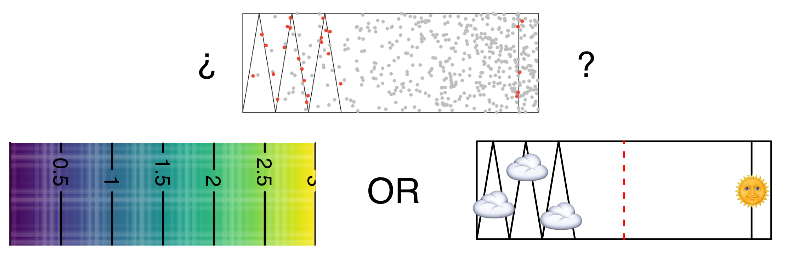
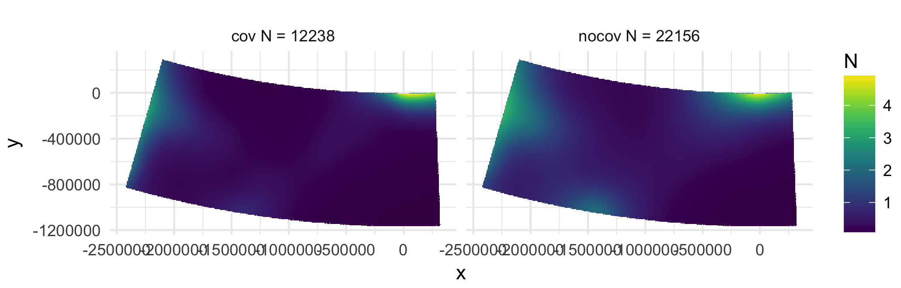

background-size: cover
<!--background-image: url(images/bg.JPG)-->

```{r include=FALSE}
library(knitr)
opts_chunk$set(cache=TRUE, echo=FALSE, message=FALSE, warnings=FALSE, errors=FALSE)
```


# Spatial models of distance sampling data

- Collect spatially referenced data
- Why not make spatially-explicit models?
- Go beyond stratified estimates
- Relate environmental covariates to counts

---

class: inverse, middle, center

# Motivating example

---

# Rhode Island loons


```{r setupdata}
library(ggplot2)
library(viridis)
library(Distance)
library(dsm)
load("data/loons.RData")

bins <- c(44, 163, 432, 1000)
loons$distbegin <- loons$distend <- NULL
```

- Wind development off RI/MA
- Map usage
- Estimate abundance
- Estimate uncertainty

<div align="center"></div>

<small>Photo by <a href="http://www.flickr.com/photos/jackanapes/44534740/in/photolist-4WfCm-5fGWY-5kcwt-gYsVe-gYsVf-rfrFy-wk8SY-Bbkf9-CJGoH-JAwGP-WnzZb-2KrNkj-3YEz3W-49jRDt-49jSgD-49jThH-4eYB5g-4f3AbJ-4iejaL-4iejgf-4nFVgg-4rqKb8-4znidm-4BSyxi-4BWPZw-4Dtb18-4DxqB5-4DxqMY-4EBCuB-4EGy24-4EGy8F-4ELPWu-4KM4T1-5byKfc-5dK7xM-5BmTVz-5GpYcr-5GpZw2-5MEqxV-5Pkq76-76qvBB-76qvNH-76uqKf-7qJ5CU-7v8iXi-7vngHz-dTvFyn-dN222q-dN1Nuj-8oFmQZ-8oFmXD/">jackanapes on flickr</a> (<a href="http://creativecommons.org/licenses/by-nc-nd/2.0/deed.en_GB">CC BY-NC-ND</a>)</small>

---

# Aerial surveys

.pull-left[
- Small plane
- 2 observers (1 each side)
- Record on dictaphone
- Transcribe later
- Glare an issue (roughly N-S transects)

<br/>


]

.pull-right[
```{r transects}
p <- ggplot(coast) +
  geom_polygon(aes(x=x, y=y, group=group), data=coast) +
  geom_segment(aes(x=bx, xend=tx, y=by, yend=ty,
                   group=Transect.Label), data=seg) +
  coord_equal(xlim=c(-42, 40), ylim=c(-40, 40)) +
  theme_void()

print(p)
```
]
---

# Non-uniform spatial distribution


<div align="center"></div>

---

# What can we do?


.pull-left[
- Stratification is not the solution
  - Arbitrary
  - Discard information
]

.pull-right[
```{r transectsagain}
print(p)
```
]

---

# Aims

- Want to estimate abundance
- Distribution in space can be important
  - (Don't always have enough information to estimate this)
- What *correlates* with distribution?
  - Environmental covariates
- Still doing *distance sampling*!
  - Need to account for detectability

---

class: inverse, middle, center

# Putting together distance sampling and spatial modelling

---

# Making our data spatial -- points

- Points
  - Know point location
  - Know number of animals seen per point

<div align="center"></div>

---

# Making our data spatial -- lines

- Lines
  - Lines are **too long**
  - Can't use as sample units
  - *Segment* the lines

<div align="center"></div>

---

# Including detectability

- Going back to *effective strip width*
  - think: *effective area*

- Effective areas are then:
  - $2 w l_j \hat{p}_j$ for lines
  - $\pi w^2 \hat{p}_j$ for points

How do we include this in our models?

---

# Building spatial models

- Want to relate *counts* per *sample unit* to covariates
- Covariates like: space, also environmental covariates?
- Spatial modelling using Generalized Additive Models (GAMs)
- 2 stage approach
  - get the detection function right
  - then model spatial distribution

---

# Spatially-referenced data

```{r predcov, fig.width=12}
eps<-1e-1

p <- list()

for(i in c("gchl_long", "depthm", "roughness")){
p[[i]] <- ggplot(pred) +
  geom_polygon(aes(x=x, y=y, group=group), data=coast) +
  geom_tile(aes_string(x="x", y="y", fill=i), width=2+eps, height=2+eps) +
  scale_fill_viridis() +
  coord_equal(xlim=c(-42, 40), ylim=c(-40, 40)) +
  theme_void() +
  theme(legend.position="bottom", legend.key.width=unit(25,"points"), legend.title.align=0.2)
}
library(gridExtra)

grid.arrange(grobs=p, layout_matrix=matrix(1:3, 1, 3))
```

---


class: inverse, middle, center

# Spatial modelling

---

# Generalised additive models


$$\mathbb{E}\left(n_j\right) = \color{red}{A_j}\color{blue}{\hat{p}_j} \color{green}{\exp}\left[\color{grey}{ \beta_0 + \sum_k s_k(z_{kj})} \right]$$

$n_j\sim$ some count distribution

- $\color{red}{\text{area of segment or circle}}$
- $\color{blue}{\text{probability of detection in segment}}$
- $\color{green}{\text{(inverse) link function}}$
- $\color{grey}{\text{model terms}}$

---

# What are those s thingos?

```{r exmodel}
df_hr <- ds(loons, key="hr", truncation=list(left=44, right=1000),
            cutpoints=bins)
df_hr_size <- ds(loons, formula=~size, key="hr",
                 truncation=list(left=44, right=1000), cutpoints=bins)

mod1 <- dsm(count ~ s(x, y, bs="ts"),
                 df_hr, seg, loons, family=tw())
mod1x <- dsm(count ~ s(x, y, bs="ts") + s(depthm, bs="ts") +
                         s(roughness, bs="ts") + s(gchl_long, bs="ts"),
                 df_hr, seg, loons, family=tw())
```

- "Smooth" functions of (spatial?) covariates
- Could be univariate, could be multivariate

```{r plotsmooths, fig.width=12}
par(mfrow=c(1,2))
plot(mod1x, select=3, shade=TRUE)
plot(mod1x, select=1, scheme=2, asp=1)
```

---

# How do we build them?

.pull-left[
```{r results='hide', fig.width=7, fig.height=7}
library(mgcv)
set.seed(2)
dat <- gamSim(1,n=400,dist="normal",scale=2)
b <- gam(y~s(x0, k=5, bs="cr"),data=dat)

# main plot
plot(b, se=FALSE, ylim=c(-1, 1), lwd=2,asp=1/2)

# plot each basis
cf <- coef(b)
xp <- data.frame(x0=seq(0, 1, length.out=100))
Xp <- predict(b, newdata=xp, type="lpmatrix")

for(i in 1:length(cf)){
  cf_c <- cf
  cf_c[-i] <- 0
  cf_c[i] <- 1
  lines(xp$x0, as.vector(Xp%*%cf_c), lty=i+1, lwd=2)
}
```
]

.pull-right[
- Functions made of other, simpler functions
- **Basis functions** $b_k$, estimate $\beta_k$ 

$$s(x) = \sum_{k=1}^K \beta_k b_k(x)$$
]


---


Straight lines vs. interpolation
=================================

.pull-left[
```{r wiggles}
library(mgcv)
# hacked from the example in ?gam
set.seed(2)
dat <- gamSim(1,n=50,dist="normal",scale=0.5, verbose=FALSE)
dat$y <- dat$f2 + rnorm(length(dat$f2), sd = sqrt(0.5))
f2 <- function(x) 0.2*x^11*(10*(1-x))^6+10*(10*x)^3*(1-x)^10-mean(dat$y)
ylim <- c(-4,6)

# fit some models
b.justright <- gam(y~s(x2),data=dat)
b.sp0 <- gam(y~s(x2, sp=0, k=50),data=dat)
b.spinf <- gam(y~s(x2),data=dat, sp=1e10)

curve(f2,0,1, col="blue", ylim=ylim)
points(dat$x2, dat$y-mean(dat$y))

```
]

.pull-right[
- Want a line that is "close" to all the data
- Don't want interpolation -- we know there is "error"
- Balance between **interpolation** and **generality**
]

---

# Making wigglyness matter

- Fit needs to be **penalised**
- What should we penalize? How wiggly the function is!
- *Something* like:

$$\int_\mathbb{R} \left( \frac{\partial^2 s(x)}{\partial x^2}\right)^2 \text{d}x$$

- Estimate the $\beta_k$ terms but penalise objective
  - "closeness to data" + penalty (REML?)

---

# Smoothing parameter


```{r wiggles-plot, fig.width=15}
# make three plots, w. estimated smooth, truth and data on each
par(mfrow=c(1,3), cex.main=3.5, cex.lab=2, mar=c(5, 5, 4, 1) + 0.1)

plot(b.justright, se=FALSE, ylim=ylim, main=expression(lambda*plain("= just right")), lwd=1.5)
points(dat$x2, dat$y-mean(dat$y), cex=1.5, pch=19)
curve(f2,0,1, col="blue", add=TRUE, lwd=1.5)

plot(b.sp0, se=FALSE, ylim=ylim, main=expression(lambda*plain("=")*0), lwd=1.5)
points(dat$x2, dat$y-mean(dat$y), cex=1.5, pch=19)
curve(f2,0,1, col="blue", add=TRUE, lwd=1.5)

plot(b.spinf, se=FALSE, ylim=ylim, main=expression(lambda*plain("=")*infinity), lwd=1.5)
points(dat$x2, dat$y-mean(dat$y), cex=1.5, pch=19)
curve(f2,0,1, col="blue", add=TRUE, lwd=1.5)
```

---

# Count distributions

.pull-left[

```{r countshist-plot}
# histogram of counts
hist(mod1$data$count, xlab="Count", main="", col="grey50", border="white",
     breaks=c(0, seq(10, 100, by=10), seq(200, 700, by=50)))
```

]

.pull-right[

- Response is a count (not not always integer)
- Often, there are a lot of zeros
- Want response distribution that deals with that
- Flexible mean-variance relationship

]

---

# Tweedie distribution

.pull-left[
```{r tweedie}
library(tweedie)
library(RColorBrewer)

# tweedie
y <- seq(0.01,5,by=0.01)
pows <- seq(1.2, 1.9, by=0.1)

fymat <- matrix(NA, length(y), length(pows))

for(i in seq_along(pows))
  fymat[,i] <- dtweedie( y=y, power=pows[i], mu=2, phi=1)


plot(range(y), range(fymat), type="n", ylab="Density", xlab="x", cex.lab=1.5,
     main="")

rr <- brewer.pal(8,"Dark2")

for(i in 1:ncol(fymat)){
  lines(y, fymat[,i], type="l", col=rr[i], lwd=2)
}
```
]

.pull-right[
-  $\text{Var}\left(\text{count}\right) = \phi\mathbb{E}(\text{count})^q$
- Common distributions are sub-cases:
  - $q=1 \Rightarrow$ Poisson
  - $q=2 \Rightarrow$ Gamma
  - $q=3 \Rightarrow$ Normal
- We are interested in $1 < q < 2$
- (here $q = 1.2, 1.3, \ldots, 1.9$)
]

---

# Abundance estimation

.pull-left[
- If we have covariates available over a grid evaluate equation

$$n_p = A_p\exp\left[ \beta_0 + s_{x,y}(x_p,y_p) +\\ s_\text{depth}(\text{depth}_p) \right]$$

- Sum grid cells for total abundance estimate
]

.pull-right[
```{r plotpred}
library(ggplot2)
library(viridis)
pred_a <- pred
pred_a$Abundance <- unlist(predict(mod1, newdata=pred,
                                      off.set=pred$cellaream))
eps<-1e-1
p <- ggplot(pred_a) +
  geom_polygon(aes(x=x, y=y, group=group), data=coast) +
  geom_tile(aes(x=x, y=y, fill=Abundance), width=2+eps, height=2+eps) +
  geom_segment(aes(x=bx, xend=tx, y=by, yend=ty,
                   group=Transect.Label), data=seg) +
  scale_fill_viridis() +
  coord_equal(xlim=c(-42, 40), ylim=c(-40, 40)) +
  theme_void() +
  theme(legend.position="bottom", legend.key.width=unit(25,"points"), legend.title.align=0.2)

print(p)
```
]

---

# Uncertainty estimation

.pull-left[
- Point estimates (even spatial ones) are not the end of the story
- Want to know how certain we are about our map
- Mapping uncertainty can help
]

.pull-right[
```{r unc}
cv <- dsm.var.gam(mod1, split(pred, 1:nrow(pred)), pred$cellaream)
pred_cv <- pred
pred_cv$CV <- sqrt(cv$pred.var)/pred_a$Abundance

pcv <- ggplot(pred_cv) +
  geom_polygon(aes(x=x, y=y, group=group), data=coast) +
  geom_tile(aes(x=x, y=y, fill=CV), width=2+eps, height=2+eps) +
  geom_segment(aes(x=bx, xend=tx, y=by, yend=ty,
                   group=Transect.Label), data=seg) +
  scale_fill_viridis() +
  coord_equal(xlim=c(-42, 40), ylim=c(-40, 40)) +
  theme_void() +
  theme(legend.position="bottom", legend.key.width=unit(25,"points"))

print(pcv)
```
]

---

class: inverse, middle, center

# Potential pitfalls

---

class: inverse, middle, center

# Tobler's first law of geography

"Everything is related to everything else,<br/>but near things are more related than distant things"

---

# Implications of Tobler's law

```{r pairrrrs, fig.width=12}
plot(seg[, c("x", "y", "depthm", "gchl_long", "roughness")], pch=19, cex=0.4)
```

---

# Selecting spatial covariates

- Complicated topic
  - What are covariates really *doing*? See later
- Several strategies
  - Stepwise AIC selection (path dependence)
  - "Shrinkage" type approaches
  - (Emprical Bayes)
- Often smooths of location are adequate
  - And keep you honest (extrapolation)


---

# Detection-level covariates


- Confounding between e.g., sea state and space important
- Pattern the same but abundance can change a LOT


<div align="center"></div>

---

# Visibility during POWER 2014


Thanks to Hiroto Murase and co for this data!

---

# Covariates can make a big difference!



---

# Spatial modelling won't solve all yr problems

.pull-left[

]

.pull-right[
- Design issues
  - Ludicrous extrapolation
  - Survey plan not robust to weather issues
  - Non-uniform distribution wrt sampler
  - Migration

**Spatial models alone can't solve these issues**
]

---

# Resources

.pull-left[

]

.pull-right[
- Loon analysis:
  - "Distance Sampling" chapter in *Quantitative Analyses in Wildlife Science*, Buckland, Miller & Rexstad
  - Winiarski, Miller, Paton, and McWilliams (2013) Spatially explicit model of wintering common loons: conservation implications. Marine Ecology Progress Series.
- Miller, Burt, Rexstad and Thomas (2013) Spatial models for distance sampling data: recent developments and future directions. Methods in Ecology and Evolution.
]

---

class: inverse, middle, center

# I am going to stop talking very soon...

---

# Summary

- We often collect spatially-explicit data
- There is information there to harness
- This *won't* solve all the problems you have

- Use 2 stage approach
  - First get your detection function right
  - *Then* do spatial modelling
- Spatial modelling is a multi-headed hydra
- Lots of things to think about

